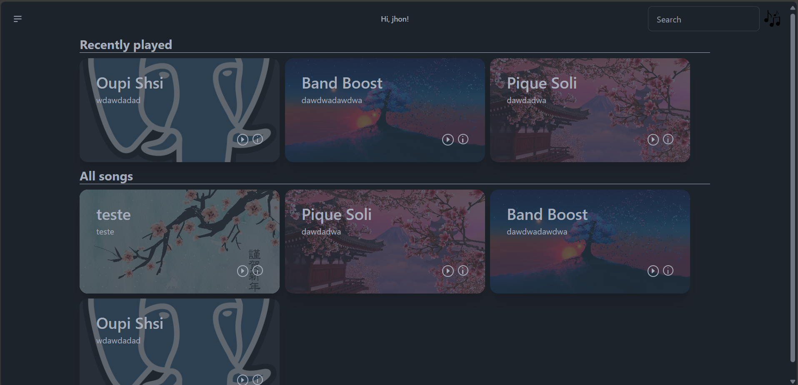
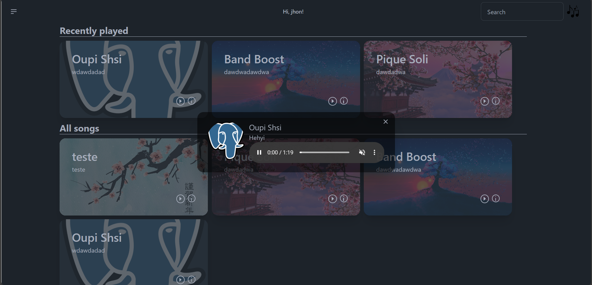

<div align="center">


<p style="font-size:30px;font-weight:700;">Django Music Player</p>
<div>

&nbsp;
&nbsp;
&nbsp;

</div>


</div>
<hr>
<div align="center">
A simple django app for add, listen and enjoy musics
</div>

### Preview



### How to run and contribut?

```bash
# clone the repository
git clone https://github.com/angelo-francisco/Healthing.git

# install the dependencies
pip install -r requirements.txt

# run and be happy!
python src/manage.py runserver
```
For contribs only send a make a project fork, then your alterations, then after send me a pull request.


### LICENSE 📜
This project has the MIT license, click here for more details [MIT LICENSE](https://opensource.org/license/mit).